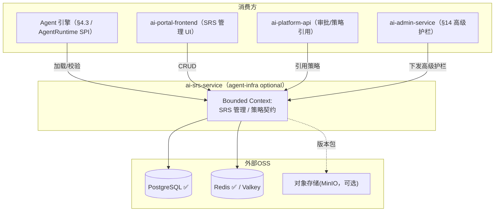
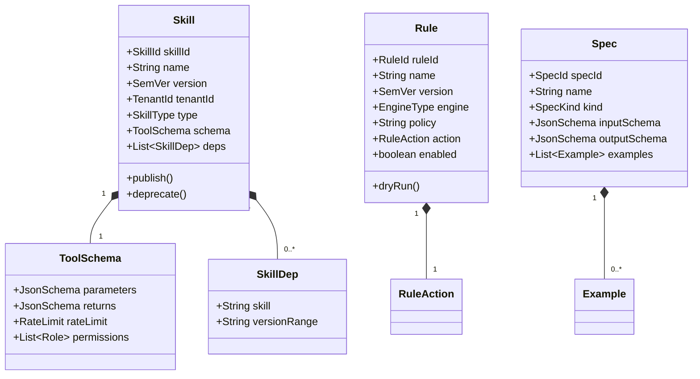
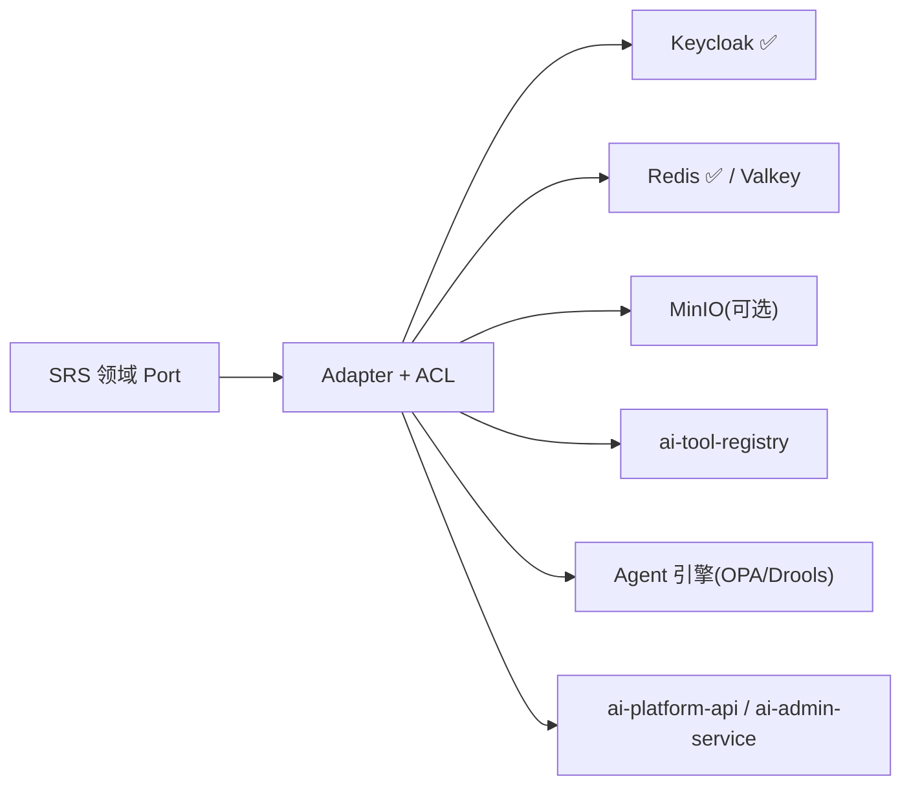
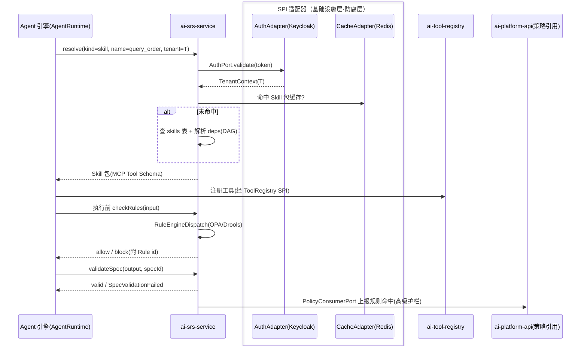
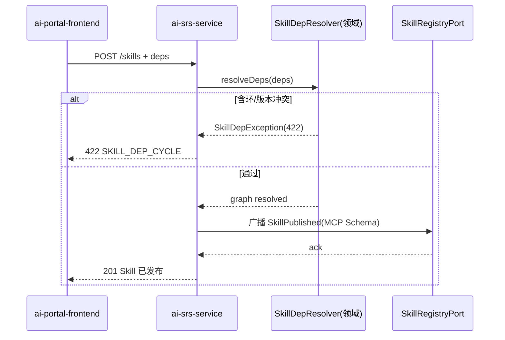

# ai-srs-service · 详细设计文档

> **元信息**
> | 项 | 值 |
> | --- | --- |
> | repo | `ai-srs-service` |
> | 语言·框架 | Java · Spring Boot 3.x（Jakarta Persistence，§15.6.1） |
> | 领域 | agent-infra |
> | optional | 是（optional，阶段二 standard 起点亮，见 `repos.yaml` / `profiles/standard.yaml`） |
> | 平台版本 | v1.4.0 |
> | 文档状态 | 草稿 |
> | 负责人 | OpenStrata 架构组 |
> | 关联链接 | [arch](./arch/ARCH.md) · [skills](./skills/SKILLS.md) · [specs](./specs/SPECS.md) · 架构文档 [§7](../../OpenStrata架构设计文档 v2.8.md) [§10.4](../../OpenStrata架构设计文档 v2.8.md) [§15.6](../../OpenStrata架构设计文档 v2.8.md) [§16](../../OpenStrata架构设计文档 v2.8.md) |

> 本文档覆盖现有占位骨架，不改动 `arch/`、`skills/`、`specs/`、`README.md`。章节严格按 16 节组织，图一律用 live ```mermaid```。

---

## 1. 领域上下文与边界（Bounded Context）

`ai-srs-service` 是 OpenStrata 的 **Skills / Rules / Specs（SRS）统一管理平台**（架构文档 §7）。它负责 SRS 内容的**存储、版本管理、检索与运行时校验**，是 Agent 运行时的"策略与契约底座"：Agent 引擎加载 Skills、执行前过 Rules、校验输入/输出 Spec。



- **边界（上游）**：经 `Auth` SPI 鉴权（Keycloak，§4.7.3）；多租户下 `tenant_id` 贯穿。
- **边界（下游）**：自身不执行 Agent、不做推理；通过 REST/SPI 把 Skills/Rules/Specs 提供给 Agent 引擎。
- **可选性**：optional，单租户小团队可纯 YAML/代码声明 SRS（§7 v2.1），不必启用本服务；standard 档起点亮（§12.2）。
- **端口**：8083（§15.2）。

---

## 2. 职责与能力清单（映射 §4 各层职责）

对齐 §4.3（Agent 基础设施层）与 §7：

| 能力 | 说明 | 映射 § |
| --- | --- | --- |
| Skill 注册 | 声明工具名/描述/参数 Schema/返回 Schema（MCP Tool Schema，§7.2） | §4.3.2 / §7.2 |
| Skill 版本管理 | 语义化版本，灰度切换（§7.2） | §7.2 |
| Skill 依赖管理 | 技能间 DAG 依赖，自动加载（§7.2） | §7.2 |
| Skill 测试验证 | Promptfoo 自动用例（§7.2） | §7.2 |
| Rule 定义/引擎 | YAML DSL / OPA(Rego) / Drools（§7.3） | §7.3 / §4.7.4 |
| Rule 版本/试运行 | Dry Run（§7.3） | §7.3 |
| Spec 管理 | 输入/输出 JSON Schema、Few-shot 示例（§7.4） | §7.4 |
| Spec 运行时校验 | 输入/输出自动校验（§7.4） | §7.4 |
| 检索与加载 | Agent 运行时按 `tenant_id`/名称/版本检索 | §7.1 |
| 权限控制 | Skill/Rule 级 RBAC（§7.2） | §7.2 / §4.7.3 |

---

## 3. 领域模型（Aggregate / Entity / Value Object / 领域事件）



**Aggregate（聚合根）**：`Skill`（含 `ToolSchema` + `SkillDep`）、`Rule`、`Spec` 各自为聚合并存版本。

**Entity（实体）**：`SkillId`/`RuleId`/`SpecId`（值对象式 ID），`SkillDep`，`Example`。

**Value Object（值对象）**：`SemVer`、`TenantId`、`SkillType`（mcp_tool/http_tool/...）、`EngineType`（opa/drools）、`RuleAction`（block/warn/log）、`JsonSchema`、`RateLimit`、`SpecKind`（input/output）。

**领域事件**
- `SkillPublished` → 广播给 Agent 引擎（经 `SkillRegistryPort`）。
- `RuleChanged` → 推送给 ai-platform-api / ai-admin-service 的高级护栏（§7.3 / §14）。
- `SpecValidated` → 输入/输出校验结果事件。
- `SkillDepGraphResolved` → DAG 解析完成，依赖可加载。

---

## 4. 应用层用例（Application Service & Use Case 列表）

| Use Case | Application Service | 事务 | 领域事件 |
| --- | --- | --- | --- |
| 注册/发布 Skill | `SkillAppService.register/publish()` | 写 | `SkillPublished` |
| Skill 版本升级/灰度 | `SkillAppService.upgrade/gray()` | 写 | `SkillPublished` |
| 解析 Skill 依赖 | `SkillAppService.resolveDeps()` | 读 | `SkillDepGraphResolved` |
| 定义/试运行 Rule | `RuleAppService.define/dryRun()` | 写/读 | `RuleChanged` |
| 启用/禁用 Rule | `RuleAppService.enable()` | 写 | `RuleChanged` |
| 创建/校验 Spec | `SpecAppService.create/validate()` | 写/读 | `SpecValidated` |
| 检索 SRS（运行时） | `SrsQueryService.resolve()` | 读 | — |
| 加载 Skill 包 | `SrsQueryService.loadSkillPackage()` | 读 | — |
| Skill 测试 | `SkillTestAppService.runTests()` | 写（异步） | `SkillTestCompleted` |

> CQRS：写走 Command Service（强一致、版本锁），读走 Query Service（Projection，缓存于 Redis）。

---

## 5. 领域服务与核心业务规则

- **`SkillVersionService`**：语义化版本（SemVer）约束；同一 `name` 多版本并存，灰度切换由 `enabled=true` 的版本对外；禁止删除被依赖的版本（依赖图校验）。
- **`SkillDepResolver`**：把 `dependencies` 解析为 DAG，检测环与版本区间冲突（§7.2）；解析失败阻断发布。
- **`RuleEngineDispatch`**：按 `engine`（opa/drools）分发策略评估；`action=block` 阻止、`warn` 告警、`log` 仅记录（§7.3）。
- **`SpecValidator`**：用 JSON Schema Validator 对 Agent 输入/输出做运行时校验（§7.4），失败抛 `SpecValidationFailed`。
- **`SrsRbacRule`**：Skill/Rule 级 RBAC（§7.2），与 `Auth` SPI 角色对齐；多租户下 `tenant_id` 强制隔离。

---

## 6. SPI 端口与适配器（Port 定义 + Adapter + ACL 防腐层，映射 §10.4）

| Port（领域层定义） | SPI 端口（bom.yaml） | Adapter 实现（默认 ✅ / 备选） | ACL 职责 |
| --- | --- | --- | --- |
| `AuthPort` | `Auth`（§4.7.3） | **Keycloak@25.0.0 ✅** | token/claims → `TenantContext`/`Role` |
| `CachePort` | `Cache`（§4.3.4） | **Redis@7.4.0 ✅** / Valkey@7.2.0 optional | SRS 检索结果、版本缓存（租户前缀） |
| `ObjectStorePort` | —（base 对象存储） | MinIO（可选，存 Skill 包/示例大文件） | 外部对象 ⇄ 内部 `SkillPackage` |
| `SkillRegistryPort` | —（§4.3.2） | REST 调用 `ai-tool-registry` / Agent 引擎 | 内部 `Skill` ⇄ MCP Tool Schema（§7.2） |
| `RuleEvalPort` | —（§7.3） | REST 调用 Agent 运行时 / 本地 OPA | 内部 `Rule` ⇄ Rego/Drools 策略 |
| `PolicyConsumerPort` | —（§14 高级护栏） | REST 调用 `ai-platform-api` / `ai-admin-service` | 内部 `Rule` ⇄ 治理 DTO |



> **多实现并存**：`CachePort` 下 Redis（core）与 Valkey（optional OSI 替代，§16.3）经同一 Port 并存、切换零改动（§10.4）。`RuleEngineDispatch` 支持 OPA/Drools 多引擎并存，由 `engine` 字段路由（同类多实现 P11）。

---

## 7. 对外 API 契约（REST/gRPC 关键路径、状态码、错误码、OpenAPI 要点）

REST（Spring MVC + SpringDoc），前缀 `/api/v1`；内部对 Agent 引擎提供 gRPC `SrsResolver`（proto 见 `specs/`）。

**关键路径**

```text
POST   /api/v1/skills                                  # 注册 Skill
POST   /api/v1/skills/{name}/versions                  # 发布新版本
GET    /api/v1/skills/{name}                           # 当前版本
GET    /api/v1/skills/{name}/versions/{ver}            # 指定版本
POST   /api/v1/skills/{name}:deprecate
POST   /api/v1/skills:resolve-deps                     # DAG 解析
GET    /api/v1/rules
POST   /api/v1/rules                                   # 定义 Rule
POST   /api/v1/rules/{id}:dry-run                      # 试运行
PATCH  /api/v1/rules/{id}                              # 启用/禁用
POST   /api/v1/specs                                   # 创建 Spec
POST   /api/v1/specs/{id}:validate                     # 运行时校验
GET    /api/v1/resolve?kind=skill&name=&ver=&tenant=   # 运行时检索/加载
POST   /api/v1/skills/{name}/versions/{ver}:test       # Skill 测试(Promptfoo)
```

**状态码**：2xx；`400` Schema 非法；`401/403` 鉴权/越权；`404` SRS 不存在；`409` 版本已存在 / 依赖冲突；`422` 依赖图含环或超出版本区间；`500` 内部。

**错误码**

```json
{
  "code": "SKILL_DEP_CYCLE",
  "message": "技能依赖存在环：auth_check -> query_order -> auth_check",
  "traceId": "c0ffee",
  "doc": "https://docs.openstrata.io/errors/SKILL_DEP_CYCLE"
}
```

**OpenAPI 要点**：`openapi.yaml` 由 SpringDoc 生成；Skill 定义复用 §7.2 的 YAML 结构；`resolve` 响应为 `AgentSpec` 兼容的 SRS 包（§4.3.5）。

---

## 8. 数据模型与持久化（表结构 / JPA / 迁移脚本）

底座：PostgreSQL@16.0（core，§16 base）。SRS 内容 + 版本 JSONB 存储；多租户按 `tenant_id` 列隔离 + RLS（§8.2）。

```sql
-- SRS 库（shared schema: srs）
CREATE TABLE skills (
  skill_id    VARCHAR(64) PRIMARY KEY,
  tenant_id   VARCHAR(64) NOT NULL,
  name        VARCHAR(128) NOT NULL,
  version     VARCHAR(32)  NOT NULL,         -- SemVer
  type        VARCHAR(32)  NOT NULL,
  schema      JSONB        NOT NULL,          -- parameters/returns/rate_limit/permissions
  deps        JSONB,                          -- [{skill, versionRange}]
  enabled     BOOLEAN NOT NULL DEFAULT FALSE,
  package_ref VARCHAR(256),                   -- 对象存储引用(可选)
  UNIQUE (tenant_id, name, version)
);

CREATE TABLE rules (
  rule_id   VARCHAR(64) PRIMARY KEY,
  tenant_id VARCHAR(64) NOT NULL,
  name      VARCHAR(128) NOT NULL,
  version   VARCHAR(32) NOT NULL,
  engine    VARCHAR(16)  NOT NULL,           -- opa / drools
  policy    TEXT         NOT NULL,
  action    VARCHAR(8)   NOT NULL,           -- block / warn / log
  enabled   BOOLEAN NOT NULL DEFAULT TRUE,
  UNIQUE (tenant_id, name, version)
);

CREATE TABLE specs (
  spec_id       VARCHAR(64) PRIMARY KEY,
  tenant_id     VARCHAR(64) NOT NULL,
  name          VARCHAR(128) NOT NULL,
  kind          VARCHAR(16) NOT NULL,         -- input / output
  input_schema  JSONB,
  output_schema JSONB,
  examples      JSONB,
  UNIQUE (tenant_id, name, kind)
);

CREATE TABLE skill_tests (
  test_id   VARCHAR(64) PRIMARY KEY,
  skill_id  VARCHAR(64) NOT NULL REFERENCES skills(skill_id),
  status    VARCHAR(16) NOT NULL,
  report    JSONB
);
```

**JPA**：`SkillEntity`/`RuleEntity`/`SpecEntity` 用 `@Convert` 序列化 JSONB；迁移 **Flyway**（`V1__srs_init.sql` / `V2__rls.sql`）。

---

## 9. 关键业务流程与时序图（Mermaid 时序，含跨服务 SPI 调用）

**流程：Agent 执行前加载 Skills + 过 Rules + 校验 Spec（§7.1）**



**流程：发布 Skill + DAG 依赖解析（§7.2）**



---

## 10. 配置与 Profile（对齐 meta profiles：starter~full + 可选能力开关）

本服务开关对齐 `profiles/*.yaml` 与 `PlatformManifest.spec.srs`（§12.1）：

```yaml
openstrata:
  service:
    port: 8083
  features:
    srs:
      enabled: false              # starter 关闭；standard/advanced/full 开启（§12.2）
    skillTest:
      enabled: true               # 用 Promptfoo 做自动化测试（§7.2）
    ruleEngine:
      opa:
        enabled: true             # 默认引擎
      drools:
        enabled: false            # 备选（行为/审批类规则，§7.3）
  spi:
    auth:   { provider: keycloak } # core 默认
    cache:  { provider: redis }    # 默认；valkey 备选（§16.3）
    objectStore:
      enabled: false               # 大文件包时开启(MinIO)
```

| Profile | srs | 说明 |
| --- | --- | --- |
| starter | false | 轻量用户可用纯 YAML 声明 SRS（§7 v2.1） |
| standard | true | 点亮规则/Spec（§11.2 阶段二 E3） |
| advanced | true | + 高级护栏(Rules)联动 admin-service |
| full | true | 全量 + Dify 低代码参考时可复用 Spec |

---

## 11. 集成点（依赖的其他服务 / SPI / 外部 OSS，引用 bom.yaml）

| 集成点 | 类型 | 实例（bom.yaml） | 说明 |
| --- | --- | --- | --- |
| Keycloak | 外部 OSS（Auth SPI） | keycloak@25.0.0 ✅ core | 鉴权/角色（§4.7.3） |
| Redis / Valkey | 外部 OSS（Cache SPI） | redis@7.4.0 ✅ / valkey@7.2.0 optional | 缓存（§16.3） |
| PostgreSQL | base 底座 | postgresql@16.0 ✅ core | 持久化 |
| MinIO（可选） | 外部 OSS（对象存储） | 对象存储 base | Skill 包/示例（§8.2 隔离矩阵） |
| ai-tool-registry | 内部服务 | Go v1.4.0 | Skill ⇄ MCP 工具（§4.3.2） |
| Agent 引擎 | 内部/运行时 | ai-gateway-core 等 | 加载/校验 SRS（§7.1） |
| ai-platform-api | 内部服务 | Java v1.4.0 | 策略引用/审批（§14） |
| ai-admin-service | 内部服务 | Java v1.4.0 | 高级护栏下发（§14） |
| ai-eval-service | 内部服务 | Python v1.4.0 | Skill 测试（Promptfoo，§7.2） |

---

## 12. 安全与多租户（鉴权 / 权限 / 数据隔离 / 审计，映射 §8·§14）

- **鉴权**：经 `AuthPort`（Keycloak），`X-Tenant-Id` 由网关注入；SRS 操作需对应角色（developer 可建、admin 可启用 Rule）。
- **权限**：Skill/Rule 级 RBAC（§7.2），与 `Auth` SPI 角色映射；多租户下 `tenant_id` 强制隔离（§8.2）。
- **数据隔离**：`tenant_id` 列 + RLS（§8.2）；对象存储用 MinIO Bucket per tenant（§8.2 矩阵）。
- **审计**：SRS 发布/启用/校验留痕，进 `audit_log`（复用控制面审计语义，§14.6 / §4.7.4）；高级护栏规则命中上报 platform-api。

---

## 13. 可观测性（日志 / 追踪 / 指标 / 审计埋点）

- **基础 Tracing + Audit（core，§4.8）**：OTel traces + 审计默认开。
- **Metrics（推荐）**：`srs_publish_count{type}`、`srs_resolve_latency`、`rule_eval_count{action}`、`spec_validation_failures`、`skill_test_pass_rate`。
- **Logging**：结构化 JSON + MDC `tenant_id`/`skill`；Loki 可选。
- **LLM 专项追踪**：规则命中/Spec 校验可关联 Langfuse@2.0.0 ✅（Tracing SPI）。

---

## 14. 部署与弹性（K8s 资源 / HPA / 探针）

- **Deployment**：`ai-srs-service`，无状态，2 副本；镜像 `openstrata/ai-srs-service:v1.4.0`。
- **命名空间**：共享 `ai-system`（§9.2）。
- **探针**：
  - liveness：`GET /actuator/health/liveness`
  - readiness：`GET /actuator/health/readiness`（依赖 PG/Redis）
- **HPA**：基于 `cpu` + `srs_resolve_qps`，min 2 / max 6。
- **资源**：request 500m / 1Gi，limit 1 CPU / 2Gi。
- **配置**：ConfigMap + Secret，Helm values 由 `ai-provisioning-engine` 渲染（§13.3）。

---

## 15. 测试策略（单测 / 集成 / 契约测试）

- **单测（领域层）**：`SkillDepResolver`（环检测/版本冲突）、`RuleEngineDispatch`（opa/drools 分发）、`SpecValidator`（JSON Schema 校验）——JUnit 5 + AssertJ，覆盖率 ≥ 85%。
- **集成**：Testcontainers（PostgreSQL + Redis）验证 JPA/JSONB/RLS/Flyway。
- **SPI 契约**：`AuthPort`/`CachePort` 与 Adapter 对照 `bom.yaml` `interface_versions` 校验（`skills/` 的 `bump-spi-version`）。
- **跨服务契约**：与 `ai-tool-registry` 的 MCP Tool Schema 契约；与 Agent 引擎的 `resolve`/`checkRules`/`validateSpec` 契约。
- **E2E**：`demo/standard` 跑"发布 Skill → Agent 加载 → 过 Rule → 校验 Spec"全链路。

---

## 16. 开放问题与待决项

1. **SRS 与 AgentSpec 收敛**：§4.3.5 的 `AgentSpec` 与本文 Skill/Tool 绑定如何正式关联？需定义 `tool_bindings` 引用 SRS skill 的规范（ADR）。
2. **Rule 引擎选型**：OPA（Rego）与 Drools 并存是否长期保留，还是收敛到 OPA 为主？影响 `ruleEngine` 默认配置。
3. **版本灰度机制**：多版本并存下的"灰度切换"是按租户还是全局？建议 tenant 级默认 + 灰度发布窗口。
4. **对象存储依赖**：Milvus 备选实例依赖对象存储（bom.yaml `depends_on: [objectStore-minio]`），SRS 大包是否复用同一 MinIO 实例需统一规划。
5. **与 admin-service 高级护栏边界**：Rules 作为 §14 高级护栏时，由谁写、谁审、谁生效，需固化流程（参考 §12.4 依赖校验）。

---

> **变更记录**
> | 版本 | 日期 | 说明 |
> | --- | --- | --- |
> | v1.0-草稿 | 2026-07-17 | 初始详细设计，覆盖占位骨架，16 节齐备 |

> **追溯矩阵（本文档章节 ↔ 架构设计文档 § 编号）**
> | 章节 | 架构文档 § |
> | --- | --- |
> | 1 领域上下文 | §7.1 / §4.3 |
> | 2 职责清单 | §7 / §4.3.2 |
> | 3 领域模型 | §15.6.2 / §7.2~7.4 |
> | 4 应用层用例 | §15.6.2 ② |
> | 5 领域服务规则 | §7.2 / §7.3 / §7.4 |
> | 6 SPI 端口与适配器 | §10.3 / §10.4 / §15.6.4 |
> | 7 对外 API 契约 | §7 / §16.4 |
> | 8 数据模型 | §8.2 / §16 base |
> | 9 业务流程时序 | §7.1 / §15.6.2.2 |
> | 10 配置与 Profile | §12.1 / §12.2 |
> | 11 集成点 | §4.7.3 / §15.2 / bom.yaml |
> | 12 安全与多租户 | §8 / §14.3 / §4.7.4 |
> | 13 可观测性 | §4.8 |
> | 14 部署与弹性 | §9.2 |
> | 15 测试策略 | §15.6.5 |
> | 16 开放问题 | — |
