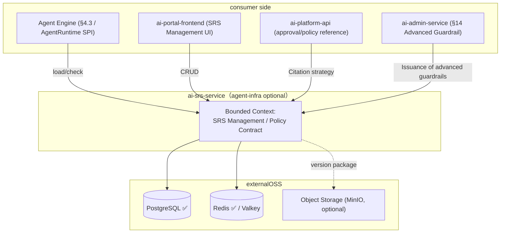
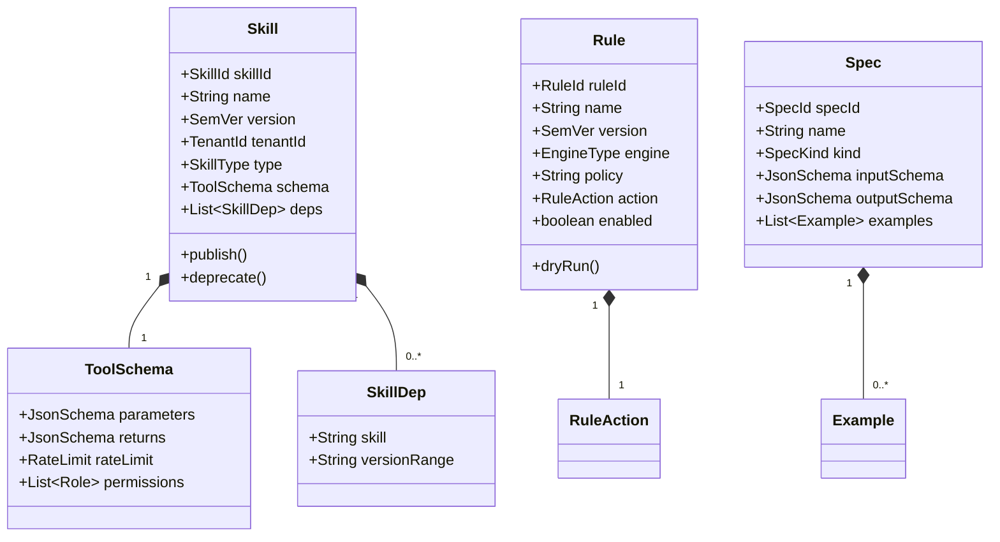
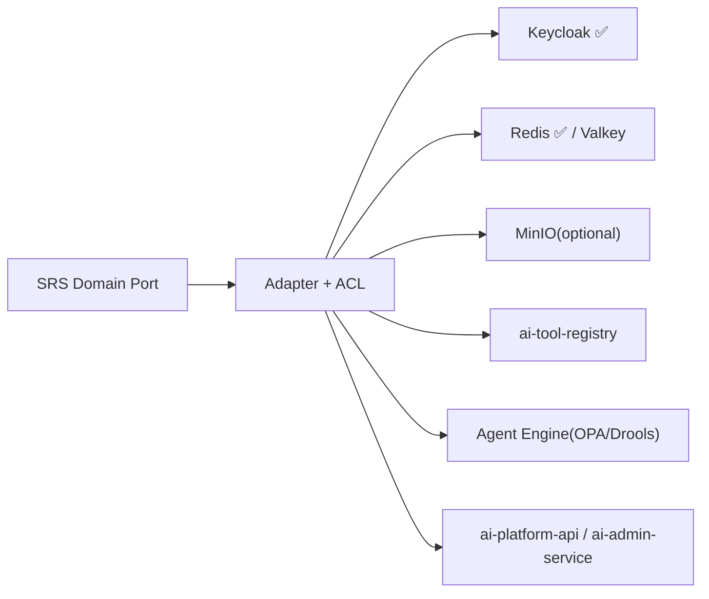
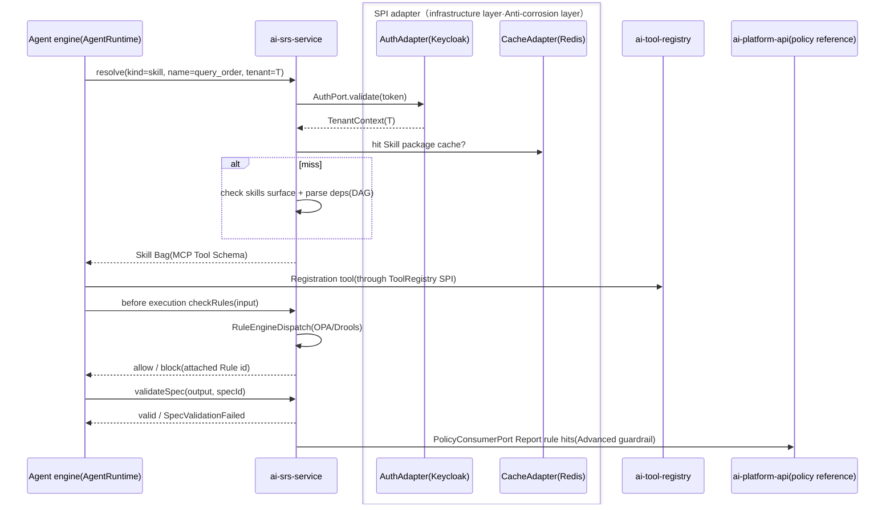
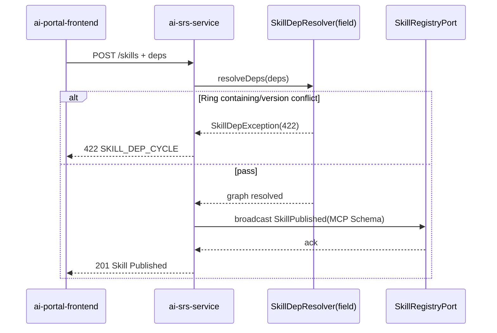

# ai-srs-service · Detailed design document

> **Meta Information**
> | item | value |
> | --- | --- |
> | repo | `ai-srs-service` |
> | Language · Framework | Java · Spring Boot 3.x (Jakarta Persistence, §15.5.1) |
> | domain | agent-infra |
> | optional | Yes (optional, phase 2 standard is turned on, see `repos.yaml` / `profiles/standard.yaml`) |
> | Platform version | v1.4.0 |
> | Document Status | Draft |
> | Responsible person | OpenStrata Architecture Group |
> | Related links | [arch](./arch/ARCH.md) · [skills](./skills/SKILLS.md) · [specs](./specs/SPECS.md) · Architecture document [§7](../../OpenStrata Architecture Design Document v2.8.md) [§10.4](../../OpenStrata Architecture Design Document v2.8.md) [§15.5](../../OpenStrata Architecture Design Document v2.8.md) [§16](../../OpenStrata Architecture Design Document v2.8.md) |

> This document covers the existing placeholder skeleton and does not change `arch/`, `skills/`, `specs/`, `README.md`. Chapters are strictly organized into 16 sections, and figures are always represented by live ```mermaid```.

---

## 1. Domain context and boundary (Bounded Context)

`ai-srs-service` is OpenStrata's **Skills/Rules/Specs (SRS) unified management platform** (Architecture Document §7). It is responsible for the storage, version management, retrieval and runtime verification of SRS content. It is the "strategy and contract base" of Agent runtime: the Agent engine loads Skills, passes Rules before execution, and verifies input/output Spec.



- **Boundary (upstream)**: `Auth` SPI authentication (Keycloak, §4.7.3); `tenant_id` penetration under multi-tenancy.
- **Boundary (Downstream)**: It does not execute the Agent or do reasoning; it provides Skills/Rules/Specs to the Agent engine through REST/SPI.
- **Optional**: optional, a small single-tenant team can declare SRS in pure YAML/code (§7 v2.1), and there is no need to enable this service; the standard file is enabled (§12.2).
- **Port**: 8083 (§15.2).

---

## 2. List of responsibilities and abilities (mapping §4 responsibilities at each level)

Align §4.3 (Agent Infrastructure Layer) with §7:

| Capabilities | Description | Mapping § |
| --- | --- | --- |
| Skill registration | Declare tool name/description/parameter Schema/return Schema (MCP Tool Schema, §7.2) | §4.3.2 / §7.2 |
| Skill version management | Semantic version, canary switching (§7.2) | §7.2 |
| Skill dependency management | DAG dependencies between skills, automatic loading (§7.2) | §7.2 |
| Skill test verification | Promptfoo automatic use case (§7.2) | §7.2 |
| Rule Definition/Engine | YAML DSL / OPA(Rego) / Drools (§7.3) | §7.3 / §4.7.4 |
| Rule Version/Trial Run | Dry Run (§7.3) | §7.3 |
| Spec Management | Input/Output JSON Schema, Few-shot Example (§7.4) | §7.4 |
| Spec runtime verification | Input/output automatic verification (§7.4) | §7.4 |
| Retrieval and loading | Retrieve by `tenant_id`/name/version when Agent is running | §7.1 |
| Permission Control | Skill/Rule Level RBAC (§7.2) | §7.2 / §4.7.3 |

---

## 3. Domain model (Aggregate / Entity / Value Object / Domain events)



**Aggregate (aggregate root)**: `Skill` (including `ToolSchema` + `SkillDep`), `Rule`, and `Spec` are each aggregated and coexisting versions.

**Entity**: `SkillId`/`RuleId`/`SpecId` (value object ID), `SkillDep`, `Example`.

**Value Object**: `SemVer`, `TenantId`, `SkillType` (mcp_tool/http_tool/...), `EngineType` (opa/drools), `RuleAction` (block/warn/log), `JsonSchema`, `RateLimit`, `SpecKind` (input/output).

**Domain Events**
- `SkillPublished` → broadcast to Agent engine (via `SkillRegistryPort`).
- `RuleChanged` → Advanced guardrails pushed to ai-platform-api / ai-admin-service (§7.3 / §14).
- `SpecValidated` → input/output verification result event.
- `SkillDepGraphResolved` → DAG resolution is completed and dependencies can be loaded.

---

## 4. Application layer use cases (Application Service & Use Case list)

| Use Case | Application Service | Transactions | Domain Events |
| --- | --- | --- | --- |
| Register/Publish Skill | `SkillAppService.register/publish()` | Write | `SkillPublished` |
| Skill version upgrade/canary | `SkillAppService.upgrade/gray()` | Write | `SkillPublished` |
| Resolve Skill dependencies | `SkillAppService.resolveDeps()` | Read | `SkillDepGraphResolved` |
| Define/test run Rule | `RuleAppService.define/dryRun()` | Write/read | `RuleChanged` |
| Enable/disable Rule | `RuleAppService.enable()` | Write | `RuleChanged` |
| Create/Validate Spec | `SpecAppService.create/validate()` | Write/Read | `SpecValidated` |
| Retrieve SRS (runtime) | `SrsQueryService.resolve()` | Read | — |
| Load Skill Package | `SrsQueryService.loadSkillPackage()` | Read | — |
| Skill Test | `SkillTestAppService.runTests()` | Write (asynchronous) | `SkillTestCompleted` |

> CQRS: Write Command Service (strong consistency, version lock), read Query Service (Projection, cached in Redis).

---

## 5. Domain services and core business rules

- **`SkillVersionService`**: Semantic version (SemVer) constraints; multiple versions of the same `name` coexist, and canary switching is performed by the version with `enabled=true`; deletion of dependent versions is prohibited (dependency graph verification).
- **`SkillDepResolver`**: parses `dependencies` into DAG, detects ring and version interval conflicts (§7.2); failure in parsing blocks release.
- **`RuleEngineDispatch`**: Distribute policy evaluation by `engine` (opa/drools); `action=block` blocks, `warn` alerts, `log` only logs (§7.3).
- **`SpecValidator`**: Use JSON Schema Validator to perform runtime verification of Agent input/output (§7.4), and throw `SpecValidationFailed` if it fails.
- **`SrsRbacRule`**: Skill/Rule level RBAC (§7.2), aligned with `Auth` SPI role; `tenant_id` enforces isolation under multi-tenancy.

---

## 6. SPI port and adapter (Port definition + Adapter + ACL anti-corrosion layer, mapping §10.4)

| Port (domain layer definition) | SPI port (bom.yaml) | Adapter implementation (default ✅ / alternative) | ACL responsibility |
| --- | --- | --- | --- |
| `AuthPort` | `Auth`（§4.7.3） | **Keycloak@25.0.0 ✅** | token/claims → `TenantContext`/`Role` |
| `CachePort` | `Cache` (§4.3.4) | **Redis@7.4.0 ✅** / Valkey@7.2.0 optional | SRS retrieval results, version cache (tenant prefix) |
| `ObjectStorePort` | — (base object storage) | MinIO (optional, save Skill package/sample large file) | External object ⇄ Internal `SkillPackage` |
| `SkillRegistryPort` | — (§4.3.2) | REST call to `ai-tool-registry`/Agent engine | Internal `Skill` ⇄ MCP Tool Schema (§7.2) |
| `RuleEvalPort` | — (§7.3) | REST call to Agent runtime/local OPA | Internal `Rule` ⇄ Rego/Drools policy |
| `PolicyConsumerPort` | — (§14 Advanced Guardrails) | REST calls to `ai-platform-api` / `ai-admin-service` | Internal `Rule` ⇄ Governance DTO |



> **Multiple implementations coexist**: Redis (core) and Valkey (optional OSI replacement, §16.3) under `CachePort` coexist through the same Port, and there is no change when switching (§10.4). `RuleEngineDispatch` supports the coexistence of OPA/Drools multiple engines and is routed by the `engine` field (multiple implementations of the same type are P11).

---

## 7. External API contract (REST/gRPC critical path, status code, error code, OpenAPI key points)

REST (Spring MVC + SpringDoc), prefix `/api/v1`; internally provides gRPC `SrsResolver` for the Agent engine (see `specs/` for proto).

**Critical Path**

```text
POST   /api/v1/skills                                  #Register Skill
POST   /api/v1/skills/{name}/versions                  #Release new version
GET    /api/v1/skills/{name}                           #Current version
GET    /api/v1/skills/{name}/versions/{ver}            #Specify version
POST   /api/v1/skills/{name}:deprecate
POST   /api/v1/skills:resolve-deps                     #DAG parsing
GET    /api/v1/rules
POST   /api/v1/rules                                   #Definition Rule
POST   /api/v1/rules/{id}:dry-run                      #Trial run
PATCH  /api/v1/rules/{id}                              #enable/disable
POST   /api/v1/specs                                   #Create Spec
POST   /api/v1/specs/{id}:validate                     #Runtime verification
GET    /api/v1/resolve?kind=skill&name=&ver=&tenant=   #Runtime retrieval/loading
POST   /api/v1/skills/{name}/versions/{ver}:test       #Skill Test(Promptfoo)
```

**Status code**: 2xx; `400` Schema illegal; `401/403` authentication/override of authority; `404` SRS does not exist; `409` version already exists/dependency conflict; `422` dependency graph contains a loop or exceeds the version range; `500` internal.

**Error code**

```json
{
  "code": "SKILL_DEP_CYCLE",
  "message": "Skill dependency exists: auth_check -> query_order -> auth_check",
  "traceId": "c0ffee",
  "doc": "https://docs.openstrata.io/errors/SKILL_DEP_CYCLE"
}
```

**OpenAPI Highlights**: `openapi.yaml` is generated by SpringDoc; Skill definition reuses the YAML structure of §7.2; `resolve` responds to an `AgentSpec` compatible SRS package (§4.3.5).

---

## 8. Data model and persistence (table structure / JPA / migration script)

Base: PostgreSQL@16.0 (core, §16 base). SRS content + versioned JSONB storage; multi-tenant isolated by `tenant_id` column + RLS (§8.2).

```sql
-- SRS Library（shared schema: srs）
CREATE TABLE skills (
  skill_id    VARCHAR(64) PRIMARY KEY,
  tenant_id   VARCHAR(64) NOT NULL,
  name        VARCHAR(128) NOT NULL,
  version     VARCHAR(32)  NOT NULL,         -- SemVer
  type        VARCHAR(32)  NOT NULL,
  schema      JSONB        NOT NULL,          -- parameters/returns/rate_limit/permissions
  deps        JSONB,                          -- [{skill, versionRange}]
  enabled     BOOLEAN NOT NULL DEFAULT FALSE,
  package_ref VARCHAR(256),                   -- Object storage reference(Optional)
  UNIQUE (tenant_id, name, version)
);

CREATE TABLE rules (
  rule_id   VARCHAR(64) PRIMARY KEY,
  tenant_id VARCHAR(64) NOT NULL,
  name      VARCHAR(128) NOT NULL,
  version   VARCHAR(32) NOT NULL,
  engine    VARCHAR(16)  NOT NULL,           -- opa / drools
  policy    TEXT         NOT NULL,
  action    VARCHAR(8)   NOT NULL,           -- block / warn / log
  enabled   BOOLEAN NOT NULL DEFAULT TRUE,
  UNIQUE (tenant_id, name, version)
);

CREATE TABLE specs (
  spec_id       VARCHAR(64) PRIMARY KEY,
  tenant_id     VARCHAR(64) NOT NULL,
  name          VARCHAR(128) NOT NULL,
  kind          VARCHAR(16) NOT NULL,         -- input / output
  input_schema  JSONB,
  output_schema JSONB,
  examples      JSONB,
  UNIQUE (tenant_id, name, kind)
);

CREATE TABLE skill_tests (
  test_id   VARCHAR(64) PRIMARY KEY,
  skill_id  VARCHAR(64) NOT NULL REFERENCES skills(skill_id),
  status    VARCHAR(16) NOT NULL,
  report    JSONB
);
```

**JPA**: `SkillEntity`/`RuleEntity`/`SpecEntity` serialize JSONB with `@Convert`; migrate **Flyway** (`V1__srs_init.sql` / `V2__rls.sql`).

---

## 9. Key business processes and sequence diagrams (Mermaid sequence, including cross-service SPI calls)

**Process: Load Skills + Pass Rules + Verify Spec before Agent execution (§7.1)**



**Process: Release Skill + DAG dependency resolution (§7.2)**



---

## 10. Configuration and Profile (align meta profiles: starter~full + optional capability switch)

This service switch aligns `profiles/*.yaml` with `PlatformManifest.spec.srs` (§12.1):

```yaml
openstrata:
  service:
    port: 8083
  features:
    srs:
      enabled: false              #starter is off; standard/advanced/full is on (§12.2)
    skillTest:
      enabled: true               #Automated testing with Promptfoo (§7.2)
    ruleEngine:
      opa:
        enabled: true             #Default engine
      drools:
        enabled: false            #Alternative (conduct/approval rules, §7.3)
  spi:
    auth:   { provider: keycloak } #core default
    cache:  { provider: redis }    #Default; value alternative (§16.3)
    objectStore:
      enabled: false               #Enable for large file packages (MinIO)
```

| Profile | srs | Description |
| --- | --- | --- |
| starter | false | Pure YAML declaration SRS available for lightweight users (§7 v2.1) |
| standard | true | Lighting rules/Spec (§11.2 Phase 2 E3) |
| advanced | true | + Advanced guardrail (Rules) linkage admin-service |
| full | true | Full + Dify can be reused for low-code reference Spec |

---

## 11. Integration point (other dependent services/SPI/external OSS, reference bom.yaml)

| Integration Point | Type | Instance (bom.yaml) | Description |
| --- | --- | --- | --- |
| Keycloak | External OSS (Auth SPI) | keycloak@25.0.0 ✅ core | Authentication/role (§4.7.3) |
| Redis / Valkey | External OSS (Cache SPI) | redis@7.4.0 ✅ / valkey@7.2.0 optional | Cache (§16.3) |
| PostgreSQL | base base | postgresql@16.0 ✅ core | persistence |
| MinIO (optional) | External OSS (Object Storage) | Object Storage base | Skill package/example (§8.2 Isolation Matrix) |
| ai-tool-registry | Internal Services | Go v1.4.0 | Skill ⇄ MCP Tools (§4.3.2) |
| Agent engine | Internal/runtime | ai-gateway-core, etc. | Loading/verifying SRS (§7.1) |
| ai-platform-api | Internal Services | Java v1.4.0 | Policy Reference/Approval (§14) |
| ai-admin-service | Internal service | Java v1.4.0 | Advanced guardrail delivery (§14) |
| ai-eval-service | Internal Service | Python v1.4.0 | Skill Test (Promptfoo, §7.2) |

---

## 12. Security and multi-tenancy (authentication/permissions/data isolation/auditing, mapping §8·§14)

- **Authentication**: Via `AuthPort` (Keycloak), `X-Tenant-Id` is injected by the gateway; SRS operations require corresponding roles (developer can create, admin can enable Rule).
- **Permissions**: Skill/Rule level RBAC (§7.2), mapped with `Auth` SPI role; `tenant_id` enforced isolation under multi-tenancy (§8.2).
- **Data isolation**: `tenant_id` column + RLS (§8.2); MinIO Bucket per tenant for object storage (§8.2 matrix).
- **Audit**: SRS release/enabling/verification traces are entered into `audit_log` (reusing control plane audit semantics, §14.6 / §4.7.4); advanced guardrail rule hits are reported to platform-api.

---

## 13. Observability (log/tracking/metrics/audit points)

- **Basic Tracing + Audit (core, §4.8)**: OTel traces + audit are enabled by default.
- **Metrics (recommended)**: `srs_publish_count{type}`, `srs_resolve_latency`, `rule_eval_count{action}`, `spec_validation_failures`, `skill_test_pass_rate`.
- **Logging**: Structured JSON + MDC `tenant_id`/`skill`; Loki optional.
- **LLM Special Tracking**: Rule hit/Spec verification can be associated with Langfuse@2.0.0 ✅ (Tracing SPI).

---

## 14. Deployment and elasticity (K8s resources/HPA/probes)

- **Deployment**: `ai-srs-service`, stateless, 2 replicas; image `openstrata/ai-srs-service:v1.4.0`.
- **namespace**: shared `ai-system` (§9.2).
- **Probe**:
  - liveness：`GET /actuator/health/liveness`
- readiness: `GET /actuator/health/readiness` (depends on PG/Redis)
- **HPA**: Based on `cpu` + `srs_resolve_qps`, min 2 / max 6.
- **Resources**: request 500m/1Gi, limit 1 CPU/2Gi.
- **Configuration**: ConfigMap + Secret, Helm values ​​rendered by `ai-provisioning-engine` (§13.3).

---

## 15. Test strategy (single test/integration/contract test)

- **Single test (domain layer)**: `SkillDepResolver` (ring detection/version conflict), `RuleEngineDispatch` (opa/drools distribution), `SpecValidator` (JSON Schema verification) - JUnit 5 + AssertJ, coverage ≥ 85%.
- **Integration**: Testcontainers (PostgreSQL + Redis) validate JPA/JSONB/RLS/Flyway.
- **SPI Contract**: `AuthPort`/`CachePort` and Adapter are checked against `bom.yaml` `interface_versions` (`bump-spi-version` of `skills/`).
- **Cross-service contract**: MCP Tool Schema contract with `ai-tool-registry`; `resolve`/`checkRules`/`validateSpec` contract with Agent engine.
- **E2E**: `demo/standard` runs the "Publish Skill → Agent Load → Pass Rule → Verify Spec" full link.

---

## 16. Open issues and pending items

1. **SRS and AgentSpec convergence**: How is the `AgentSpec` in §4.3.5 formally related to the Skill/Tool binding in this article? `tool_bindings` needs to be defined to reference the specification (ADR) of the SRS skill.
2. **Rule engine selection**: Will the coexistence of OPA (Rego) and Drools be retained for a long time, or will it converge to OPA as the main one? Affects `ruleEngine` default configuration.
3. **Version canary mechanism**: Is the "canary switching" under multi-version coexistence per tenant or globally? Recommended tenant level default + canary publishing window.
4. **Object storage dependency**: The Milvus alternative instance depends on object storage (bom.yaml `depends_on: [objectStore-minio]`). Whether the SRS large package reuses the same MinIO instance requires unified planning.
5. **Boundary with admin-service advanced guardrails**: When Rules are used as §14 advanced guardrails, who writes, reviews, and takes effect requires a solidified process (refer to §12.4 Dependency Verification).

---

> **Change Record**
> | Version | Date | Description |
> | --- | --- | --- |
> | v1.0-Draft | 2026-07-17 | Initial detailed design, covering the placeholder skeleton, 16 sections complete |

> **Traceability Matrix (this document section ↔ Architectural Design Document § number) **
> | Chapters | Architecture Documentation § |
> | --- | --- |
> | 1 Domain context | §7.1 / §4.3 |
> | 2 Responsibilities List | §7 / ​​§4.3.2 |
> | 3 Domain Model | §15.5.2 / §7.2~7.4 |
> | 4 Application layer use cases | §15.5.2 ② |
> | 5 Domain Service Rules | §7.2 / §7.3 / §7.4 |
> | 6 SPI Ports and Adapters | §10.3 / §10.4 / §15.5.4 |
> | 7 External API Contract | §7 / ​​§16.4 |
> | 8 Data Model | §8.2 / §16 base |
> | 9 Business process timing | §7.1 / §15.5.2.2 |
> | 10 Configuration and Profile | §12.1 / §12.2 |
> | 11 integration points | §4.7.3 / §15.2 / bom.yaml |
> | 12 Security and Multi-Tenancy | §8 / §14.3 / §4.7.4 |
> | 13 Observability | §4.8 |
> | 14 Deployment and Resilience | §9.2 |
> | 15 Testing Strategies | §15.5.5 |
> | 16 Open Questions | — |
